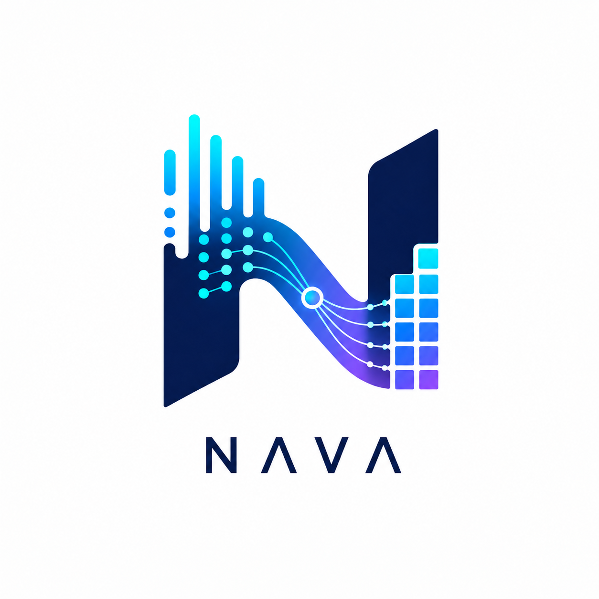
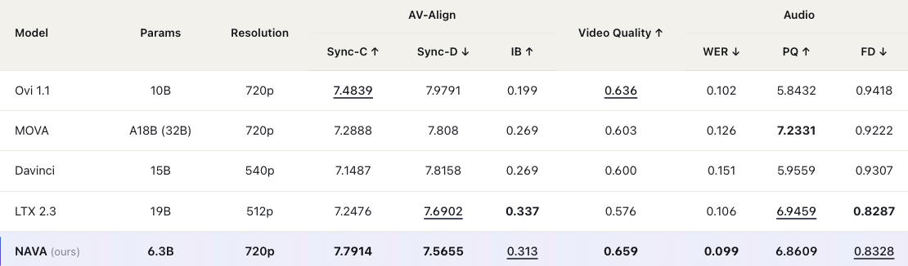
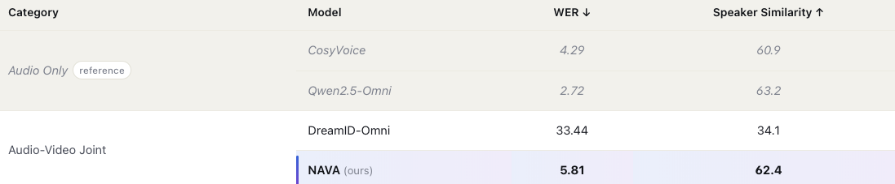
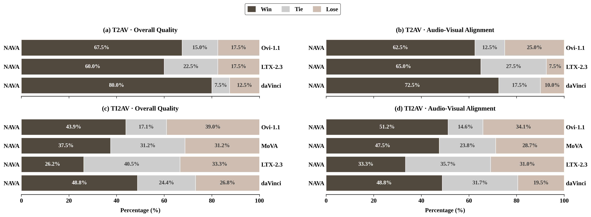

<p align="center">
  
</p>

# NAVA — Native Audio-Visual Alignment for Generation

<p align="center">
  <a href="https://ernie-research.github.io/NAVA"></a>
  <a href="https://arxiv.org/abs/XXXX.XXXXX"></a>
  <a href="https://huggingface.co/ernie-research/NAVA"></a>
  <a href="LICENSE"></a>
</p>

NAVA is a Native Audio-Visual Alignment framework that formulates joint audio-video generation as *context-conditioned native audio-visual alignment*. NAVA first establishes audio-video correspondence in a dedicated alignment space and then applies context as external conditioning to guide the aligned representation. It is instantiated with an Align-then-Fuse MMDiT architecture, which progressively bridges modality-aware alignment and unified audio-video denoising. To support controllable speech generation, NAVA further introduces Timbre-in-Context Conditioning, which binds reference timbre cues to corresponding speech spans through the context pathway. With only **6.3B** parameters, NAVA achieves superior audio-visual synchronization and video quality, competitive audio quality, and substantially improved reference-timbre controllability.

## Demo

<div align="center">

https://github.com/user-attachments/assets/917bafe1-c015-4b55-9814-3f94e0970710

</div>

---

## Features

- **720p in ~1 Minute** — Generate synchronized 720p audio-video in about one minute on 8 GPUs with Ulysses sequence parallelism.
- **Native Stereo Audio** — Jointly generate scene sounds and speech with video, no post-hoc vocoder alignment required.
- **Multi-Timbre Voice Control** — Bind reference WAVs to `<S>...<E>` spans for precise per-speaker voice identity.
- **Text-Driven Camera Control** — Specify shot composition, camera motion, and pacing directly in the prompt.
- **Flexible Aspect Ratios** — Generate landscape, portrait, and square videos from the same checkpoint.

## Quick Start

**1. Install dependencies**

```bash
pip install torch torchvision torchaudio
pip install diffusers==0.35.2 transformers==4.57.1 accelerate==1.12.0 safetensors
pip install open_clip_torch einops scipy numpy PyYAML tqdm sentencepiece
pip install flash-attn --no-build-isolation
```

**2. Download weights** (one command pulls `NAVA.ckpt` and all dependencies into the project root):

```bash
huggingface-cli download robingg1/NAVA --local-dir ./
```

**3. Run inference** (8 GPUs with sequence parallel):

```bash
# Example 1 — General T2AV (text-only)
bash scripts/inference.sh

# Example 2 — I2AV + Timbre Control (first-frame image + reference voice)
bash scripts/inference_timbre.sh
```

For batch runs, custom prompts, or other modes, see [Inference](#inference). For the full weight manifest, see [Model Weights](#model-weights).

> [!TIP]
> **For optimal generation quality, always rewrite your prompt before inference** — especially if your input is short or in English. NAVA is primarily trained on high-quality Chinese dense captions; the rewriter expands a brief description into a single-paragraph cinematic prompt that activates the model's full potential. See [Prompt Engineering](#prompt-engineering-rewrite) for the three available pathways.

## Model Architecture

NAVA uses a **30-layer Align-then-Fuse MMDiT** backbone with flow matching:

- **10 Hierarchical Alignment Layers**: dedicated audio/video paths establish fine-grained AV correspondence in a native alignment space — independent QKV per modality, joint self-attention over concatenated video + audio tokens, and per-stream text cross-attention.
- **20 Unified Fusion Layers**: a single shared transformer stack performs context-conditioned denoising on the aligned representation — shared QKV/FFN, joint self-attention across all tokens, unified text cross-attention.
- **Timbre-in-Context Conditioning**: reference-WAV speaker embeddings are bound to `<S>...<E>` speech spans through the context pathway, enabling per-speaker timbre control without entangling identity into the alignment space.
- **RoPE**: 3D rotary embeddings for video (T + H + W), 1D for audio; **AdaLN-Zero** timestep modulation per block.

## Evaluation

### General Capability on VerseBench

NAVA achieves the best AV synchronization (Sync-C / Sync-D / IB) and video quality with the smallest parameter budget.

<p align="center">
  
</p>

### Timbre-Control Speech Performance

Audio-only models are listed as *reference* only — they are dedicated speech systems and not directly comparable. Among joint audio-video models, NAVA delivers speech quality close to dedicated audio-only systems.

<p align="center">
  
</p>

### User Study

We conduct human GSB (Win / Tie / Lose) preference studies on both T2AV and TI2AV against open-source baselines (Ovi-1.1, LTX-2.3, MoVA, daVinci). NAVA wins on both **Overall Quality** and **Audio-Visual Alignment** across all comparisons.

<p align="center">
  
</p>

## Inference

### Input Format (JSONL)

All inference modes use a unified **JSONL** format (one JSON object per line):

```jsonl
{"prompt": "一位男子在海边奔跑，镜头跟随。写实电影感，自然光。背景是海浪声和风声。"}
{"prompt": "描述文本...", "image_path": "/abs/path/to/first_frame.png"}
{"prompt": "两人对话<S>Hello<E><S>Hi there<E>", "spk_wavs": ["/path/to/spk1.wav", "/path/to/spk2.wav"]}
{"prompt": "...", "image_path": "/path/to/img.png", "spk_wavs": ["/path/to/spk.wav"]}
```

| Field | Required | Description |
|-------|----------|-------------|
| `prompt` | Yes | Text caption (also accepts legacy `text` field name) |
| `image_path` | No | Absolute path to first frame image → auto-enables I2V mode for this sample |
| `spk_wavs` | No | List of absolute paths to speaker reference WAVs (max 2) for timbre control |

A single JSONL file can mix text-only, I2V, and timbre-control entries.

### Batch Inferencer

Each GPU independently processes a slice of the input JSONL — best for many-prompt throughput. Defaults to `infer_cases/general/prompts.jsonl`; override with env vars.

```bash
bash scripts/inference_batch.sh

# Custom paths:
CKPT=/path/to/your.ckpt \
DATA_FILE=/path/to/prompts.jsonl \
OUT_DIR=eval_results/batch_run1 \
bash scripts/inference_batch.sh
```

### Sequence Parallel (SP=8, Recommended for Single-Sample)

All 8 GPUs cooperatively process the same sample for faster inference:

```bash
SETUPTOOLS_USE_DISTUTILS=stdlib torchrun \
    --nnodes=1 \
    --nproc_per_node=8 \
    --master_addr=127.0.0.1 \
    --master_port=29507 \
    inference_nava.py \
    --config configs/nava.yaml \
    --ckpt your_nava_checkpoint.ckpt \
    --out_dir ./eval_results_sp \
    --data_format json \
    --data_file your_data.jsonl \
    --width 1280 \
    --height 704 \
    --frames 37 \
    --fps 24 \
    --steps 50 \
    --save_sample \
    --gen_turn 1 \
    --use_sp
```

### Gradio Interactive Demo (SP=8)

Web UI with prompt rewriting, image upload, and speaker reference:

```bash
cd gradio_demo
bash start_gradio.sh
```

Or with custom paths:

```bash
bash gradio_demo/start_gradio.sh \
    --config /path/to/config.yaml \
    --ckpt /path/to/checkpoint.ckpt \
    --rewrite_model /path/to/Qwen3-4B-Thinking-2507 \
    --port 8000 \
    --nproc 8 \
    --share
```

Debug mode (no models, UI only):
```bash
python gradio_demo/gradio_server.py --debug --port 8000
```

### Prompt Engineering (Rewrite)

For optimal generation quality, **always rewrite your prompt before inference** — especially if the input is in English or short. NAVA is primarily trained on **high-quality Chinese dense captions**; the rewriter expands a brief description into a single-paragraph cinematic prompt with explicit subject / scene / motion timeline / camera language / audio design — the format that activates the model's full potential.

We ship three rewrite pathways. **Pick by use case:**

| Pathway | Backend | Speed (per prompt) | Best for |
|---|---|---|---|
| **A. vLLM batch server** (`pe_src/`) | Qwen3-4B-Thinking-2507 served via vLLM, async HTTP, concurrency=32 | < 2 s | Offline batches (10s ~ 10000s of prompts) |
| **B. Local transformers, single** (`gradio_demo/rewrite_single.py`) | Same model, loaded in-process via `transformers` | 40 ~ 80 s | One-off CLI test, small batches |
| **C. Gradio "Rewrite" button** | Same as B, hosted inside the Gradio worker | 40 ~ 80 s | Interactive UI sessions |

All three share the **same system prompt** (`pe_src/prompts/rewrite_template.txt` ≡ `gradio_demo/rewrite_single.py:SYSTEM_PROMPT`) and the same sampling profile (temperature 0.3, top_p 0.75, top_k 20, repetition_penalty 1.05), so output style is consistent across paths. **Speech spans wrapped in `<S>...<E>` are preserved verbatim** — the rewriter is instructed to never translate or split them, and `pe_src/rewrite.py` post-checks `<S><E>` pair counts between input and output.

#### A. Batch rewrite via vLLM server  ★ recommended

**Step 1 — start the vLLM server** (one-time, runs in background, writes `server.log` + `server.pid`):

```bash
cd pe_src

# Standalone GPU (full speed, ~14 GB):
bash start_server.sh --gpu 0

# Sharing GPU 0 with the 8-GPU NAVA backbone (~14 GB ceiling, eager mode,
# backbone sees ~10–15% slowdown):
bash start_server.sh --gpu 0 --low-footprint
```

The launcher polls `http://localhost:8000/v1/models` and exits 0 once the server is ready. Stop it any time with `bash stop_server.sh`.

**Step 2 — run batch rewrite**:

```bash
# Input: one prompt per line (literal "\n" allowed, will be unescaped)
cat > my_prompts.txt <<'EOF'
A man surfing a huge wave at sunset, cinematic.
两个人在咖啡馆对话<S>How are you<E><S>I'm good, thanks<E>
EOF

python pe_src/rewrite.py \
    --input my_prompts.txt \
    --output my_prompts_rewritten.txt \
    --concurrency 32
```

Outputs are line-aligned with the input. Failed rows are written as `[ERROR] ...` instead of crashing the batch — re-run those individually after fixing the underlying issue. Use `--format jsonl` to emit `{"text": "..."}` lines instead of plain text.

**Step 3 — feed into inference**: convert the rewritten txt into the JSONL format expected by `inference_nava.py` (preserving any `image_path` / `spk_wavs` from your original data), then run as in [Quick Start](#quick-start-8-gpu).

> **Tuning knobs** in `pe_src/config.yaml`: `concurrency` (default 32), `temperature` (0.3), `max_tokens` (4096 — bumped to fit the thinking model's chain-of-thought + the rewrite). All overridable via CLI flags `--concurrency` / `--temperature`.

#### B. Single-prompt rewrite via local transformers

For ad-hoc testing without spinning up a server:

```bash
python gradio_demo/rewrite_single.py "A man surfing a huge wave at sunset"

# Or batch from a file (sequential, slow):
python gradio_demo/rewrite_single.py \
    --input my_prompts.txt \
    --output my_prompts_rewritten.txt \
    --model pe_src/Qwen3-4B-Thinking-2507
```

Loads the rewriter model into the current process — no server needed, but ~40–80 s per prompt because thinking is sequential. Add `--4bit` to fit on a smaller GPU.

#### C. Click-to-rewrite inside Gradio

The Gradio demo (`gradio_demo/start_gradio.sh`) embeds a **"Rewrite Prompt"** button next to the prompt textbox. Clicking it calls the same backend as path B, with the rewriter automatically offloaded to CPU during NAVA inference to free GPU memory. Speech-tag pair counts are validated; mismatches surface a warning in the UI.

Best for interactive iteration; for any batch >5 prompts, switch to path A.
## Configuration

The repository ships a single inference config — `configs/nava.yaml` — used by every script (`scripts/inference.sh`, `scripts/inference_timbre.sh`, `gradio_demo/start_gradio.sh`).

### Key Config Options

```yaml
modality: audio_video          # audio_video / audio / video
pipeline: nava_src.pipeline_nava.AudioVideoPipeline
use_bf16: true
scheduler_unipc: true          # UniPC multi-step scheduler (faster)
use_mmdit_model: true          # Use unified MMDiT (vs older FusionModel)
align_3d_cfg: true             # 3D cross-modal CFG for AV alignment

# Guidance scales
video_guidance_scale: 3.0      # Video CFG strength
audio_guidance_scale: 2.0      # Audio CFG strength
video_align_guidance_scale: 3.0  # Video cross-modal alignment
audio_align_guidance_scale: 2.0  # Audio cross-modal alignment

# Timbre CFG (used together with --timbre_cfg + spk_wavs in JSONL)
timbre_cfg: true                 # Master switch (CLI --timbre_cfg overrides)
timbre_align_guidance_scale: 3.0 # Strength of speaker-reference steering;
                                 # ↑ tighter timbre match, ↓ more model freedom

# Model architecture
model:
  joint_config: nava_src/models/nava/configs/model/dit/NAVA_6B.json
  ckpt_dir: ./                 # Wan2.2-TI2V-5B weights directory
  # audio_vae_ckpt_dir: /path/to/audio_vae/params   # optional override

# Data
data:
  audio_tokens_per_sec: 25
  video_fps: 24
  add_spk_emb: true            # Enable speaker embeddings
  spk_emb_prob: 0.9            # Speaker embedding injection probability
```

## Model Weights

The single `huggingface-cli download` in [Quick Start](#quick-start) pulls everything below — listed here for reference and licensing transparency.

| Path | Size | Source |
|---|---|---|
| `NAVA.ckpt` | 24 GB | NAVA |
| `Wan2.2-TI2V-5B/Wan2.2_VAE.pth` | 2.7 GB | mirrored from [Wan-AI/Wan2.2-TI2V-5B](https://huggingface.co/Wan-AI/Wan2.2-TI2V-5B) |
| `Wan2.2-TI2V-5B/models_t5_umt5-xxl-enc-bf16.pth` | 11 GB | mirrored from Wan-AI/Wan2.2-TI2V-5B |
| `Wan2.2-TI2V-5B/google/umt5-xxl/{spiece.model,tokenizer.json}` | 21 MB | T5 tokenizer |
| `params/LTX2/ltx-2.3-22b-dev_audio_vae.safetensors` | 348 MB | mirrored from [Lightricks/LTX-Video](https://github.com/Lightricks/LTX-Video) (LTX-2 Community License — see `params/LTX2/LICENSE`) |

The LTX audio-VAE Python code is vendored under `nava_src/vendor/ltx_core/` (see its `NOTICE.md` and `LICENSE`), so no separate clone of the LTX repo is needed. The ReDimNet speaker embedder is fetched automatically via `torch.hub` on first run.

## Citation

If you find NAVA useful in your research, please cite:

```bibtex
@article{nava2026,
  title   = {NAVA: Native Audio-Visual Alignment for Generation},
  author  = {ERNIE Team},
  journal = {arXiv preprint},
  year    = {2026},
}
```

## Acknowledgements

NAVA is built on top of excellent open-source work:

- **[Wan2.2-TI2V-5B](https://huggingface.co/Wan-AI/Wan2.2-TI2V-5B)** — base video DiT and Causal 3D VAE
- **[LTX-Video](https://github.com/Lightricks/LTX-Video)** — Audio VAE (LTX 2.3)
- **[BigVGAN](https://github.com/NVIDIA/BigVGAN)** — neural vocoder
- **[umt5-xxl](https://huggingface.co/google/umt5-xxl)** — multilingual T5 text encoder
- **[ReDimNet](https://github.com/IDRnD/ReDimNet)** — speaker embedding extractor
- **[Qwen3](https://huggingface.co/Qwen/Qwen3-4B-Thinking-2507)** — prompt rewriter backbone

We also thank the open-source community for releasing strong baselines including **Ovi**, **MOVA**, **Davinci** and **LTX**, which made fair benchmarking possible.

## NAVA Star History

[](https://star-history.com/#baidu/NAVA&Date)
